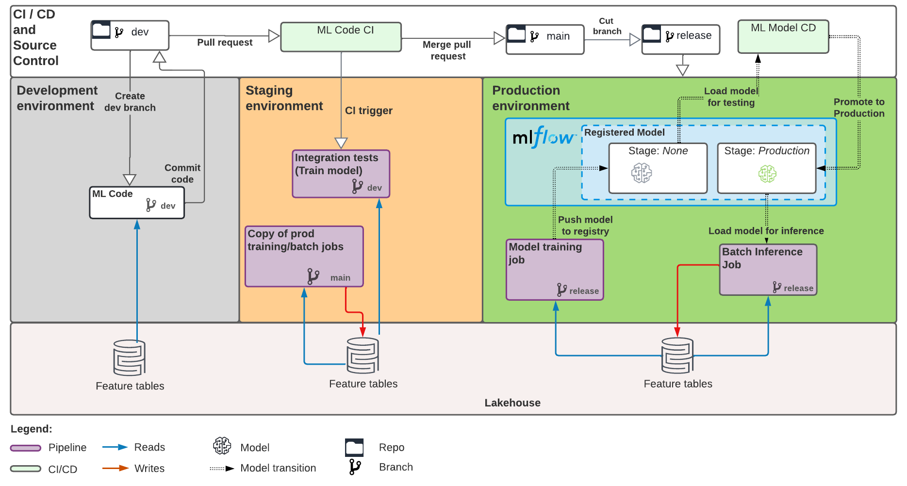

# Project Overview

[(back to main README)](../README.md)

## ML pipeline structure
This project defines an ML pipeline for automated retraining and batch inference of an ML model
on tabular data.

See the full pipeline structure below. The [stacks README](https://github.com/databricks/mlops-stack/blob/main/Pipeline.md)
contains additional details on how ML pipelines are tested and deployed across each of the dev, staging, prod environments below.




## Code structure
This project contains the following components:

| Component                  | Description                                                                                                                                                                                                                                                                                                                                             |
|----------------------------|---------------------------------------------------------------------------------------------------------------------------------------------------------------------------------------------------------------------------------------------------------------------------------------------------------------------------------------------------------|
| ML Code                    | Example ML project code, with unit tested Python modules and notebooks                                                                                                                                                                                                                                                                                  |
| ML Resource Config as Code | ML pipeline resource config (training and batch inference job schedules, etc) configured and deployed through [databricks CLI bundles](https://learn.microsoft.com/azure/databricks/dev-tools/cli/bundle-cli)                                                                                                                                       |
| CI/CD                      | [GitHub Actions](https://github.com/actions) workflows to test and deploy ML code and resources  |

contained in the following files:

```
gh-mlops-stack-dab         <- Root directory. Both monorepo and polyrepo are supported.
│
├── gh_mlops_stack_dab       <- Contains python code, notebooks and ML resources related to one ML project. 
│   │
│   ├── requirements.txt        <- Specifies Python dependencies for ML code (for example: model training, batch inference).
│   │
│   ├── bundle.yml              <- bundle.yml is the root ML resource config file for the ML project that can be loaded by databricks CLI bundles. It defines the bundle name, workspace URL and resource config component to be included.
│   │
│   ├── training                <- Folder for model development via MLflow recipes.
│   │   │
│   │   ├── steps               <- MLflow recipe steps (Python modules) implementing ML pipeline logic, e.g. model training and evaluation. Most
│   │   │                          development work happens here. See https://mlflow.org/docs/latest/recipes.html for details
│   │   │
│   │   ├── notebooks           <- Databricks notebook that runs the MLflow recipe, i.e. run the logic in `steps`. Used to
│   │   │                          drive code execution on Databricks for CI/CD. In most cases, you do not need to modify
│   │   │                          the notebook.
│   │   │
│   │   ├── recipe.yaml         <- The main recipe configuration file that declaratively defines the attributes and behavior
│   │   │                          of each recipe step, such as the input dataset to use for training a model or the
│   │   │                          performance criteria for promoting a model to production.
│   │   │
│   │   ├── profiles            <- Environment-specific (e.g. dev vs test vs prod) configurations for MLflow recipes execution.
│   │
│   │
│   ├── validation              <- Optional model validation step before deploying a model.
│   │
│   ├── monitoring              <- Model monitoring, feature monitoring, etc.
│   │
│   ├── deployment              <- Model deployment and endpoint deployment.
│   │   │
│   │   ├── batch_inference     <- Batch inference code that will run as part of scheduled workflow.
│   │   │
│   │   ├── model_deployment    <- As part of CD workflow, promote model to Production stage in model registry.
│   │
│   ├── tests                   <- Unit tests for the ML project, including modules under `steps`.
│   │
│   ├── databricks-resources     <- ML resource (ML jobs, MLflow models) config definitions expressed as code, across dev/staging/prod/test.
│       │
│       ├── model-workflow-resource.yml                <- ML resource config definition for model training, validation, deployment workflow
│       │
│       ├── batch-inference-workflow-resource.yml      <- ML resource config definition for batch inference workflow
│       │
│       ├── ml-artifacts-resource.yml                  <- ML resource config definition for model and experiment
│       │
│       ├── monitoring-workflow-resource.yml           <- ML resource config definition for data monitoring workflow
│
├── .github                     <- Configuration folder for CI/CD using GitHub Actions. The CI/CD workflows run the notebooks
                                   under `notebooks` to test and deploy model training code
```

## Next Steps
See the [main README](../README.md#using-this-repo) for additional links on how to work with this repo.
